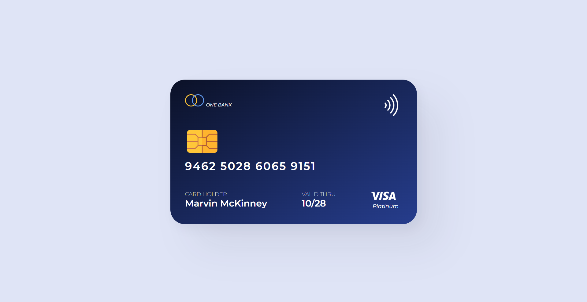

# A Simple Credit Card

## Project Overview

### Description

A visually appealing credit card design built using HTML and CSS.

➡️[Live Link](https://credit-card-kappa-three.vercel.app/)

### Screenshots

### Technologies Used

- **Figma** – For creating the initial design and layout.
- **HTML** – Used to structure the card design.
- **CSS** – Used to style and enhance the card's appearance.

### Learnings & Outcome

- Learned the basics of HTML tags to create structured content.
- Gained experience with CSS styling techniques, including:
  - Positioning elements precisely.
  - Adding colors, fonts, and a consistent design style.

### Connect with Me

Stay connected and explore more of my work:

Thank you for checking out my project! Let’s stay connected and build something amazing. **Happy coding!** 🚀
